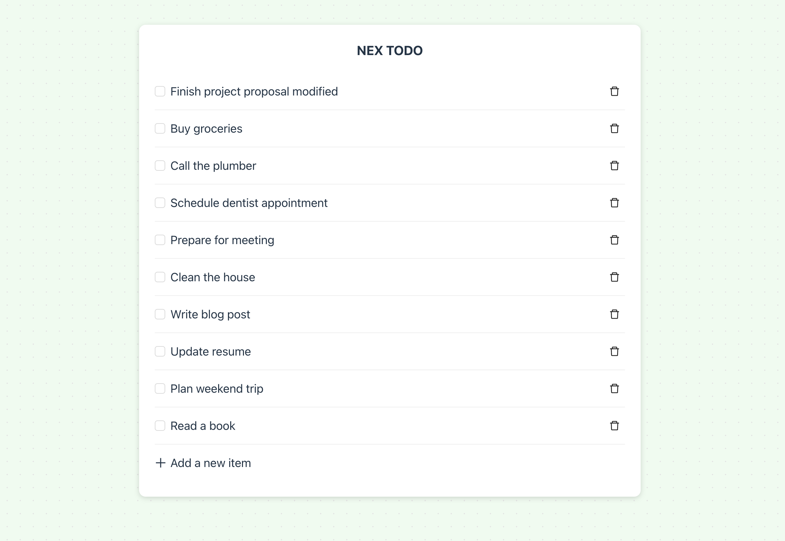

# Nex Todo App

## Overview



NEX Todo App is a full-stack applicationallows the user to read, create and update a to-do list.

This repository contains the backend API built with Node.js and Express, using PostgreSQL for data storage, as well as the frontend built with React and Ant Design.

## Tech Stack

- **Frontend**: React, TypeScript, Ant Design
- **Backend**: Node.js, TypeScript, Express
- **Database**: PostgreSQL

## Setup

### Prerequisites

Ensure you have the following software installed:

- Node.js (v20.x or later)
- npm (v10.x or later)
- PostgreSQL (v16.x or later)

### Clone the repository

First, clone the repository and navigate into the project directory:

```bash
git clone https://github.com/ijoshwang/nex-todo-app.git
cd nex-todo-app
```

### Install and Configure PostgreSQL

#### Install PostgreSQL

1. Follow the instructions for your operating system to install PostgreSQL from the [official website](https://www.postgresql.org/download/).
2. Activate the UUID extension in PostgreSQL, which is essential for generating unique identifiers:

```sql
CREATE EXTENSION IF NOT EXISTS "uuid-ossp";
```

#### Create the Database and User

```sh
psql -U postgres
CREATE DATABASE nex_todo_db;
CREATE USER nex_todo WITH ENCRYPTED PASSWORD 'your_password';
GRANT ALL PRIVILEGES ON DATABASE nex_todo_db TO nex_todo;
```

### Configure Environment Variables

- Backend
  Rename `.env.example` to `.env` and configure the environment variables:

  ```sh
  PORT=3000
  DB_HOST=localhost
  DB_USER=nex_todo
  DB_PASSWORD=your_password
  DB_NAME=nex_todo_db
  DB_PORT=5432
  CLIENT_URL=http://localhost:5000
  ```

- Frontend
  Rename `.env.example` to `.env` and configure the environment variables:
  ```sh
  REACT_APP_API_BASE_URL=http://localhost:3000/api/v1
  PORT=5000
  ```

Make sure to replace your_password with the actual password you set for your PostgreSQL user.

Adjust any other environment variables as needed for your specific setup.

### Run the Application with Docker

You can run the entire application using Docker for a seamless setup.

1. Ensure Docker and Docker Compose are installed on your machine.
2. Use the .env file in the root directory.
3. Run the following command to start the services:

```sh
docker compose up --build
```

This will build and start all the services defined in your compose.yaml file.

Visit the frontend at [http://localhost:5000](http://localhost:5000)

### Run the Application without Docker

You can also run both the backend and frontend concurrently using a single command from the root directory:

```
npm start
```

Visit the frontend at http://localhost:5000

Or, you can run backend and frontend independently.

#### Backend Setup

1. Navigate to the `backend` directory and install dependencies:

```
cd backend
npm install
```

2. Initialize the database:

```sh
npm run setup-db
```

3. Start the backend server:

```
npm start
```

#### Frontend Setup

1. Navigate to the `frontend` directory and install dependencies:

```
cd ../frontend
npm install
```

2. Start the frontend server:

```
npm start
```

Visit the frontend at http://localhost:5000

### Testing

Navigate to the respective directories (`backend` or `frontend`) and run the tests using:

```sh
npm test
```

Ensure all tests pass before deploying the application.

## Features

### Completed

- **Todos CRUD**: Create, read, update, delete duties.
- **Responsive**: UI is responsive and works well on various devices.
- **Database Connection**: PostgreSQL connection properly configured and tested.
- **Error Handling**: Implemented error handling and validation.
- **Unit Tests**: Wrote unit tests for backend and frontend.
- **API Documentation**: All API endpoints documented.
- **README**: Detailed setup and usage instructions provided.

## Directory Structure

```plaintext
nex-todo-app/
├── README.md
├── backend/
│   ├── package.json
│   ├── src/
├── frontend/
│   ├── package.json
│   ├── public/
│   ├── src/
└── package.json
```

## API Documentation

### Base URL

```
http://localhost:3000/api/v1
```

### Endpoints

#### GET `/duties`

- **Response**:
  ```json
  [
    {
      "id": "string",
      "name": "string",
      "is_completed": "boolean",
      "created_at": "string",
      "updated_at": "string"
    }
  ]
  ```

#### GET `/duties/:id`

- **Query Parameters**:

  - `id`: UUID of the duty

- **Response**:
  ```json
  {
    "id": "string",
    "name": "string",
    "is_completed": "boolean",
    "created_at": "string",
    "updated_at": "string"
  }
  ```

#### POST `/duties`

- **Request Body**:
  ```json
  {
    "name": "string"
  }
  ```
- **Response**:

  - **Status 201**: Created

  ```json
  {
    "id": "string",
    "name": "string",
    "is_completed": "boolean",
    "created_at": "string",
    "updated_at": "string"
  }
  ```

#### PUT `/duties/:id`

- **Query Parameters**:

  - `id`: UUID of the duty

- **Request Body**:
  ```json
  {
    "name": "string",
    "is_completed": "boolean"
  }
  ```
- **Response**:
  ```json
  {
    "id": "string",
    "name": "string",
    "is_completed": "boolean",
    "created_at": "string",
    "updated_at": "string"
  }
  ```

#### DELETE `/duties/:id`

- **Query Parameters**:

  - `id`: UUID of the duty

- **Response**:
  - **Status 204**: No Content

### Error Handling

The API uses the HTTP Status and a custom error handler that captures and formats errors. Errors are represented by an error code that the frontend uses to display appropriate messages.

Status include:

- **500 Internal Server Error**: For unexpected errors.
- **404 Not Found**: When a resource is not found.
- **400 Validation Error**: For validation errors in the request data.

Custom Error Code and Message:

| Code                      |                        Message                         |
| ------------------------- | :----------------------------------------------------: |
| ERR_INVALID_ID            |                ID must be a valid UUID                 |
| ERR_INVALID_NAME          | Name must be a string and between 1 and 100 characters |
| ERR_INVALID_IS_COMPLETED  |             is_completed must be a boolean             |
| ERR_NOT_FOUND             |                   Resource not found                   |
| ERR_INTERNAL_SERVER_ERROR |                 Internal Server Error                  |
